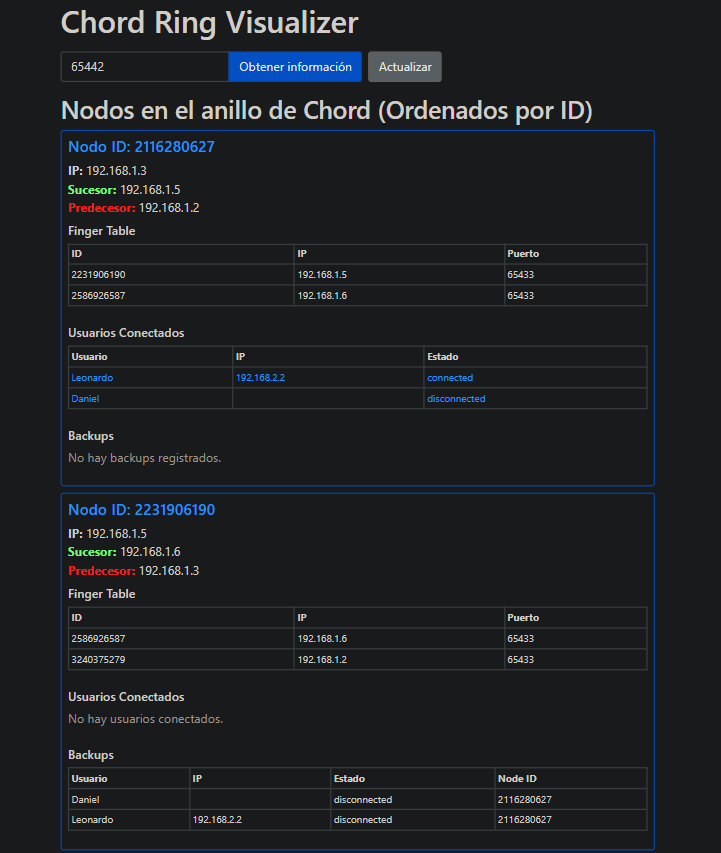

# Distributed-Systems-Project: **P2P-Chat**

**P2P-Chat** is a decentralized messaging platform that allows users to communicate directly without relying on central servers. It ensures privacy, security, and efficient message delivery using a peer-to-peer (P2P) architecture. The system integrates **local caching**, **SQLite databases** for user-specific storage, and **Docker-based networking** to simulate real distributed environments.

By implementing a **CHORD ring architecture**, P2P-Chat enables efficient data lookup, replication to K successors, and fault tolerance. If a node fails, its data remains accessible through replicated backups. **Multicast discovery** allows dynamic identification of servers within the network.

Developed in **Python** and containerized using **Docker**, the platform uses **RSA public-key cryptography** and **bcrypt** for secure authentication and message encryption. The system is designed for both academic exploration and real-world distributed applications.

---

## Features

### General

- **Decentralized Messaging**: Direct peer-to-peer messaging without central servers.
- **CHORD Ring Architecture**: Ensures data consistency, efficient lookups, and fault tolerance.
- **Data Replication**: Each server replicates data to K successors, maintaining availability.
- **Message Persistence**: Offline messages are cached and delivered when users reconnect.
- **Multicast Discovery**: Servers dynamically discover each other using multicast.
- **Secure Authentication**: User credentials are hashed with `bcrypt`, and RSA encryption secures communications.
- **Fault Tolerance**: Resilient messaging even during node or network failures.
- **Docker Integration**: Each client and server runs in isolated containers to mimic distributed networks.

---

## Client Functionalities

1. **User Registration & Login**  
   - Register with a unique username and password.  
   - Generates RSA key pairs for secure communication.  
   - Supports single-session logins — logging in from a new client disconnects the old session and transfers messages.

2. **Messaging**  
   - Direct messaging between users.  
   - Cached messages for offline recipients.  
   - Automatic delivery when recipients reconnect.  
   - Local storage of chat history using SQLite.

3. **Chat Management**  
   - View chat history, including delivered and pending messages.  
   - Check recipient status before sending messages.  
   - Seamless session transitions between devices.

4. **Client GUI**  
   - Run the client interface with:  
     ```bash
     docker exec -it client1 bash
     streamlit run app.py
     ```  
   - A simple interface for managing chats, sending messages, and viewing history.

---

## Server Functionalities

1. **User & Connection Management**  
   - Manages user registration, authentication, and status updates.  
   - Tracks active users and their IPs across the network.  
   - Uses multicast for dynamic discovery of new servers.

2. **CHORD Ring & Data Replication**  
   - Implements CHORD ring architecture for efficient data distribution.  
   - Replicates user data to K successors for fault tolerance.  
   - Each server has two databases:  
     - `users`: Stores user credentials and metadata.  
     - `backups`: Contains replicated data from other nodes.

3. **Heartbeat Monitoring**  
   - Regular health checks to track online status.  
   - Automatically marks users as offline after inactivity.

4. **Server GUI (CHORD Visualizer)**  
   - Visualize the CHORD ring using:  
     ```bash
     python visualizer/app.py
     ```  
   - It will prompt for a port. Use the port from the server’s Docker container (check `docker-compose.yml`).  



---

## Security

- **Password Security**: Passwords are hashed using `bcrypt`.  
- **Message Encryption**: RSA public-key encryption secures all messages.  
- **Data Integrity**: Ensured through consistent replication and encrypted transfers.

---

## Setup Instructions

### Prerequisites

- Docker  
- Python 3.x  
- Streamlit (for client GUI)  

### Running the Application

1. Clone the repository:
   ```bash
   git clone https://github.com/DanielMPMatCom/Distributed-Systems-Project.git
   cd Distributed-Systems-Project
   ```

2. Build and launch the Docker containers:

   **Linux:**
   ```bash
   chmod +x startup.sh
   ./startup.sh
   ```

   **Windows:**
   ```bash
   ./startup.bat
   ```

3. Start client or server GUIs as needed.

4. To change server IP:
   ```bash
   docker network disconnect distributed-systems-project_server_network server
   docker network connect --ip 192.168.1.3 distributed-systems-project_server_network server
   ```

---

## Additional Notes

- Logging in from a new client automatically transfers messages and disconnects the previous session.  
- The CHORD ring visualizer helps monitor server connections and data distribution.  
- Ensure all Docker containers are properly networked for seamless communication.
